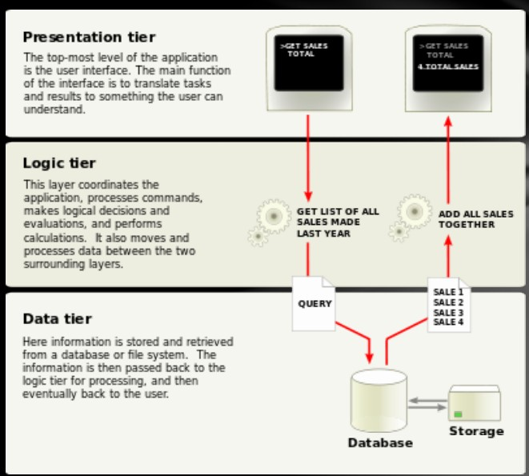

# 1、HTTP

简单的说说HTTP

超文本传输协议(Hyper Text Transfer Protocol)，在TCP之上，默认端口号是80.有两个主要的版本HTTP1.0和HTTP1.1

用户打开于服务器的TCP连接，并向服务器发送HTTP请求；

服务器接收来自客户的TCP连接，处理用户发来的HTTP请求，并返回HTTP响应

## 报文

每个响应和请求都有三部分

* 请求or响应行
* 首部行(header line)
* 实体行(entity body)
  * 如果是client，会发送额外的数据，这种数据通常是使用CGI程序，用POST方法，对于GET方法，参数也会编码进URL

### HTTP请求

必须包含

* 方法method

* 通用资源标识符(universe resource identifier，**URI**)
* 协议版本
* 可选择的是别的信息来修改和补充请求

~~~http
GET /stuff/Funny/silly.html HTTP/1.0
User-agent: NCSA Mosaic 
Accept: text/plain
Accept: text/html
Accept: application/postscript
Accept: image/gif
~~~

第二行标识的是**发送请求的浏览器类型**。接下来的行表明了客户准备接收的数据的类型，是并列的关系(plain是以纯文本表示的，html则是用html语言书写的，postscript一种页面描述语言)

HTTP别的请求方法

* GET
* POST
* HEAD
* PUT
* DELETE

### HTTP响应

首先是状态行(标记之前的请求是否成功)，然后是meta information，最后是实际的请求的信息

~~~http
HTTP1.0 Status 200 Document follows
Server: NCSA/1.4
Date: Tue,4 Jul,1996 19:04 GMT
Content-type: text/html
Content-length: 5280 
Last-modified: Wed,1 Jan 1996 01:00:02 GMT

The contents of the document requested
~~~

第二行指示了HTTP服务器的软件

## URLs

语法是<scheme>://<authority><path>?<query>

authority是权限，用于限定资源的命名空间，格式是username@hostname:portnumber

path是资源所在的路径

query是应用的特定的信息

## HTTPS

HTTP不是特别安全，需要有加密通讯(encrypt the communication)，可以

* 防止窃听(eavesdropping)
* 防止中间人攻击
* 用于保护用户身份验证
* 绕过IDS/IPS（入侵检测系统和入侵防御系统）

HTTPS固有的信任基于预安装在浏览器软件中的主要证书颁发机构。但是无法保护免受Web应用程序的攻击 

# 2、Web Languages

Web语言有

* 用于定义网页内容的HTML 
* CSS指定网页的布局，specify the layout of web pages
* JavaScript以指定网页的行为 

## HTML

是超文本标记语言，**使用标签描述文档内容**。既包含HTML标签也包含文档内容，HTML文档也被称为网页

~~~html
<!DOCTYPE html>
< html>
< body>
< h1>My First Heading</h1>
< p>My first paragraph.

< /body>
< /html>
~~~

细节

~~~
• The DOCTYPE declaration defines the document type 
• The text between <html> and </html> describes the web page 
• The text between <body> and </body> is the visible page content 
• The text between <h1> and </h1> is displayed as a heading 
• The text between 
 and 
 is displayed as a paragraph 
~~~

### headings

html的头是定义在<del>h开头</del>的标签里的。

**搜索引擎能够利用heading中的内容索引结构和网页的内容。**

可以在paragraph中增加一个br来表示换行。

### HTML注释

可以使用<!-->来表示HTML注释

### HTML链接

标签中的a表示一个超链接，最重要的是href属性，指示链接的目的地

### HTMLhead

~~~
The following tags can be added to the head section: <title>, 

</head>
~~~

内联样式表

不推荐

有优先级

* Browser default 
* External style sheet 
* Internal style sheet (in the head section) 
* Inline style (inside an HTML element)

越往后优先级越高

## JavaScript

用于增加HTML页面的交互性，通常直接插入在HTML页面中(
    </head>
    
    <body>
        <h1>My Web Page</h1>
        
A Paragraph

        <button type="button" onclick="myFunction()">Try it</button>
    </body>  
</html>    
~~~

getElementById 是一个method，而innerHTML 是一个attribute。

外部的JavaScript

~~~html
<!DOCTYPE html>
<html>
<body>

</body>
</html>
~~~

网页被加载的时候，浏览器就会创建一个DOM(文件目标模型)树

### 功能

* JavaScript可以更改页面中的所有HTML属性 
* JavaScript可以更改页面中的所有CSS样式 
* JavaScript可以删除现有的HTML元素和属性 
* JavaScript可以添加新的HTML元素和属性 
* JavaScript可以对页面中所有现有的HTML事件做出反应 
* JavaScript可以在页面中创建新的HTML事件 

### DOM Programming Interface

the getElementById() method

the inner HTML property

常见的HTML方法

| method                             | description                               |
| ---------------------------------- | ----------------------------------------- |
| document.getElementById ()         | Finding an element by element id          |
| document.getElementsBy TagName()   | Finding elements by tag name              |
| document.getElementsBy ClassName() | Finding elements by class name            |
| document.forms[]                   | Finding elements by HTML element  objects |

HTML DOM navigation

DOM Nodes

根据W3C HTML DOM标准，HTML文档中的所有内容都是一个节点： 

* 整个文档是一个文档节点 
* 每个HTML元素都是一个元素节点 
* HTML元素内的文本是文本节点 
* 每个HTML属性都是一个属性节点 
* 所有评论均为评论节点 

~~~
<html> is the parent of <head> and <body>
• <head> is the first child of <html>
• <body> is the last child of <html>

<head> has one child: <title>
• <title> has one child (a text node): "DOM Tutorial"
• <body> has two children: <h1> and 

• <h1> has one child: "DOM Lesson one"
• 
 has one child: "Hello world!"
• <h1> and 
 are siblings
~~~

节点名称的属性

* nodeName属性指定节点的名称。 
* nodeName为只读
* 元素节点的nodeName与标签名称相同 
* 属性节点的nodeName是属性名称 
* 文本节点的nodeName始终为#text 
* 文档节点的nodeName始终为#document 

# 3.Web Framework

**Web应用程序框架（WAF）是一种软件框架**，旨在支持动态网站，Web应用程序，Web服务和Web资源的开发。 该框架旨在减轻与Web开发中执行的常见活动相关的开销。 

例如，许多框架提供用于数据库访问，模板框架和会话管理的库，并且它们通常促进代码重用。

## MVC

**Model-view-controller(MVC)模式，三层组织形式。**

模型视图控制器（MVC）是用于实现用户界面的软件模式。 它将给定的软件应用程序划分为三个相互联系的部分，以便将信息的内部表示形式与信息向用户呈现或从用户接受的方式分开 

* 模型的中心组件由应用程序数据，业务规则，逻辑和功能组成。 
* 视图可以是信息的任何输出表示， 例如图表或图表。 可以使用同一信息的多种视图，例如用于管理的条形图和用于会计的表格视图。 
* 第三部分，控制器，接受输入并将其转换为模型或视图的命令。 

## 常见的三层架构

* 表现层
  * 这是应用程序的最高级别。 表示层显示与诸如浏览商品，购买和购物车内容之类的服务有关的信息。
  * 它**与其他层进行通信，从而将结果发布到浏览器/客户端层以及网络中的所有其他层**。 （简单来说，它是用户可以直接访问的一层，例如网页或操作系统GUI）
* 应用层
  * 也称为业务逻辑，逻辑层或中间层 
  * 逻辑层从表示层中拔出，作为自己的层，它通过**执行详细的处理**来控制应用程序的功能。
* 数据层
  * 数据层包括数据持久性机制（数据库服务器，文件共享等）和封装持久性机制并公开数据的数据访问层。 
  * 数据访问层应向应用程序层提供一个API，**该API公开用于管理存储的数据的方法**，而不会暴露或创建对数据存储机制的依赖关系。 
  * 避免依赖于存储机制，可以在不影响甚至不知道更改的情况下更新或更改它们，而不会影响应用程序层客户端。 

## SSH

常用的解释有安全外壳协议(Secure Shell)、strut、spring和hibernate(JavaEE开发的三种模式)以及一种非常流行的开源的Web应用框架。

**SSH框架分为四个层：表示层，逻辑层，数据持久性层和域模块层**，以帮助开发人员在短期内构建清晰的结构，可以很好地重用和维护Web应用程序的程序。 

* struts
  * Struts基础结构系统作为一个整体，负责MVC分离，控制业务逻辑；
* spring
  * 还在应用中
* hibernate

# 4.Web Server Language

## 服务器端脚本

Server Side script

许多动态构建的网页大多是静态的。 CGI，ISAPI和Servlet使您可以通过程序生成整个页面，即使大多数页面始终相同 

服务器端脚本环境允许您在HTML文档中包括服务器端脚本（以及客户端脚本）。 

服务器端脚本在发送给客户端之前由网络服务器解释并转换为HTML，因此客户端的浏览器甚至看不到服务器端脚本 。

常用的脚本语言：ASP，JSP,PHP, Perl，Python

### jsp

JavaScript Pages是一种使用Java servlet容器将动态内容插入HTML或XML页面的技术。

换句话说，您可以向每个客户端及其每次接收到的HTML页面发送不同的HTML页面，而不是将HTML页面发送到始终彼此相同的Web客户端（例如，使用数据库数据）。 

* 语法

jsp使用不同的分隔符(delimiter)来执行脚本功能

~~~jsp
<%……%> 脚本段(scriptlet)是用户请求界面时运行的Java代码的一部分。

<%=……%>表达式，将要计算的表达式放在java servlet类中。 表达式不应以半冒号(semicolon)终止

<%@……%>评论，注释HTML注释是<!……>，需要加以区分
~~~

~~~html

Counting to three;

<% for (int i=1;i<4;i++){%>
	
This number is <%=i%>.

<% }%>

    OK.

~~~

* 指令(directives)

JSP指令添加在JSP页面的顶部。 这些指令控制JSP编译器如何生成servlet。

只有导入的指令才可以多次运行

* 行为

jsp：param

可以在jsp：include，jsp：forward或jsp：params块内使用。 指定将添加到请求的当前参数中的参数。

jsp: forward

处理另一个jsp的请求和响应。

~~~html
<jsp:forward page="subpage.jsp" >
<jsp:param name="forwardedFrom" value="this.jsp" />
</jsp:forward>
~~~

jsp: plugins

### PHP

PHP是“ **PHP超文本预处理器**”的缩写。 PHP是一种广泛使用的开源脚本语言。PHP脚本在服务器上执行。PHP不花钱，可以免费下载和使用

特点有

* **跨平台支持(cross platform support)**（PWS，IIS和Apache Web服务器） 
* 开源，由Rasmus Lerdorf在1994年开发。 
* 专为网络设计的语言。 
* 通常在过程中运行(typically run in process)。 
* 出色的字符串处理能力（如Perl） 
* 与MySQL紧密集成（快速） 
* Zend优化编译器（市售）

缺点是

* Quick and dirty (“stubborn function-over-form approach”). 
* Poor error handling 
* “Tedious” objected-oriented programming support. 
* Normally interpreted

# 5.Introduction of SQL

SQL是结构化查询语言，能够运行访问和操作数据库。

**RDBMS是关系型数据库管理系统**。**SQL不区分大小写**。

开源的LAMP软件

Linux

apache

MySQL

PHP

